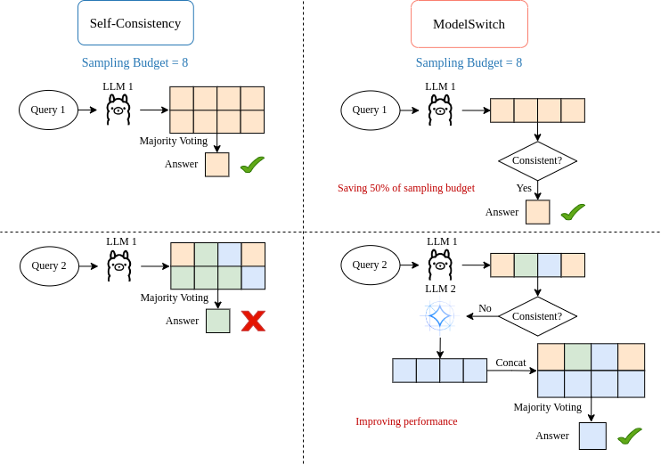
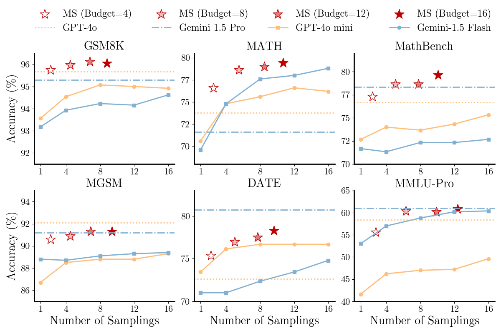
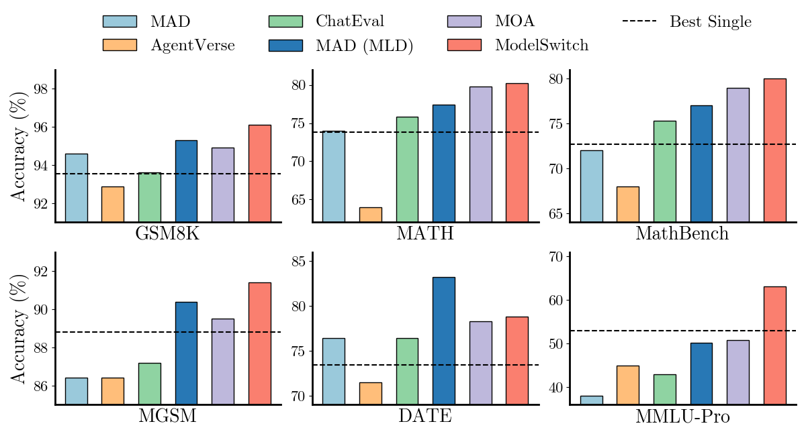
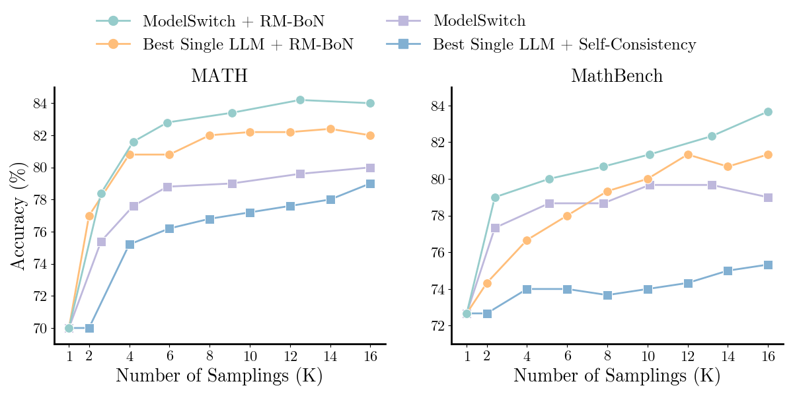

# ModelSwitch




This is the repository for our arxiv paper [[2504.00762] Do We Truly Need So Many Samples? Multi-LLM Repeated Sampling Efficiently Scales Test-Time Compute](https://arxiv.org/abs/2504.00762).

Some of the data and code are still being organized and will be available soon.

## Installation


```
pip install -r requirements.txt
```

## Quick Start


```
python src/Model_swtich.py \
    --dataset_name "GSM8K" \
    --num_workers 250 \
    --Sampling True \
    --Sampling_Numbers 250\
    --results_sampling 5 \
    --modellist "gpt-4o-mini|gemini-1.5-flash-latest"\
    --ConsistencyThreshold 1  \
    --Open_SourceModel False \
```

## Experimental Results


### ModelSwitch vs. Self-Consistency



```
python src/Evaluation.py \
    --Evaluation "MS_SC" \
    --dataset "GSM8K" \
    --budget 16 
```

### ModelSwitch vs. Multi-Agent Debate



```
python src/Evaluation.py \
    --Evaluation "MS_MAD" \
    --dataset "GSM8K"

```

### Combined with Reward Model



```
python src/Evaluation.py \
    --Evaluation "RM" \
    --dataset "MathBench"
```

## Citation


@article{chen2025we,
  title={Do We Truly Need So Many Samples? Multi-LLM Repeated Sampling Efficiently Scale Test-Time Compute},
  author={Chen, Jianhao and Xun, Zishuo and Zhou, Bocheng and Qi, Han and Zhang, Qiaosheng and Chen, Yang and Hu, Wei and Qu, Yuzhong and Ouyang, Wanli and Hu, Shuyue},
  journal={arXiv preprint arXiv:2504.00762},
  year={2025}
}
